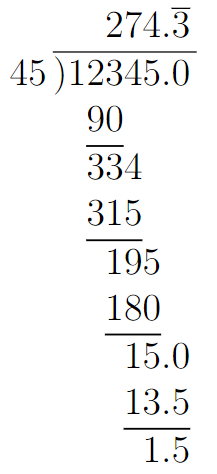

# Operations

## Contents

- [Operations](#operations)
  - [Contents](#contents)
  - [Overview](#overview)
  - [Arithmetic Operations](#arithmetic-operations)
    - [Long Division](#long-division)
  - [Exponentiation, Roots, Logarithms](#exponentiation-roots-logarithms)
    - [Relations](#relations)
  - [Ordering](#ordering)
    - [Order of Operations](#order-of-operations)
    - [Operator Ordering Conventions](#operator-ordering-conventions)
  - [Closing](#closing)

## Overview

Mathematics wouldn't be of much use if you could not do things to numbers. The "do things" part describes an *operation*, or an action performed on number(s) to create some result.

Operations bring different rules, terms, and conventions and are a foundational aspect of math. You should know these terms:

- ***Operand***: Number or *term* that is undergoing the action from an *operator* to produce a solution.
- ***Operator***: A symbol used to denote a specific action to be done to the operands.
  - Examples: addition (Symbol: $+$), subtraction (Symbol: $-$), etc.
- ***Operation***: Describes the overall actions being done to operands.
  - Examples: addition, subtraction, multiplication, division, etc.

As an example, in $2 + 3$, the operand describes the $2$ and the $3$, the operator describes the $+$, and the operation is *addition*!

## Arithmetic Operations

There are plenty of different operations. The first and "simplest" are arithmetic operations.

- ***Addition*** - Total amount of two or more values combined together. Take two apples, grab two more, now you have four apples.
  - Example: $2 + 3 = 5$
  - Read as: "two plus three equals one"
- ***Subtraction*** - remove one value from another.
  - Example: $3 - 2 = 1$
- ***Multiplication*** - Basically repeated addition. "If I earned $4 every day for 5 days, how much money do I have?"
  - Example: $4 * 5 = 4 + 4 + 4 + 4 + 4 = 20$
  - Read as: "four times five equals 20"
- ***Division*** - Repeated subtraction. "If it took 2 hours to drive 50 miles, how fast was I going?"
  - Example: $50 / 2 = 25$, so you were going 25 miles per hour.
  - Inverse: Multiplication

> Arithmetic really just refers to these operations; arithmetic *is* addition, subtraction, multiplication, and division.

This table summarizes the arithmetic operations

| Operation | Operator | Operands | Result | Syntax | Inverse |
| --------- | -------- | -------- | ------ | ------ | ------- |
| Addition | $+$ | Addend, summand | Sum | $addend + addend = sum$ | Subtraction |
| Subtraction | $-$ | Subtrahend, minuend. Subtrahere | Difference | $subtrahend - subtrahere = difference$ | Addition |
| Multiplication | $*$ or $x$ or $\cdot$ | Factor, multiplicand, multiplier | Product | $factor * factor = product$ | Division |
| Division | $/$ or $\div$ | Divisor. Dividend. | Quotient | $divisor / dividend = quotient$ | Multiplication |

***

***

### Long Division

Long division is a method of division where the divisor is placed under a special symbol. The dividend is placed to the left, and the quotient is calculated step by step above. Differences are computed below the divisor. This is a method of doing division by hand.

    
     
    Long Division Example

Notice that division is not even here. There will be cases where division is not even. In this case, the "leftover" is the *remainder*.

***Remainder*** - This is the number left over from division. Like, $5 / 2 = 2.5$. You could also state that $5 / 2 = 2$ with a remainder of $1$. This remainder can also be used to make a mixed form (number and fraction): $5 / 2 = 2 \frac{1}{2}$

## Exponentiation, Roots, Logarithms

- ***Exponentiation*** - Repeated multiplication. Multiplies a number by itself. Number of multiplications dictated by its exponent.
  - ***Base*** - Number undergoing the operation
  - ***Exponent*** - Number of multiplication operations to perform.
  - ***Power*** - Result of exponentiation.
  - Syntax: If base = $B$, exponent = $x$, and power = $P$, then, $B^x=P$
  - Example: $2^3 = 8$
  - You can invert this operation in two ways:
    - Find the exponent using the *logarithm*, where the logarithm's base is the base of exponentiation.
    - Find the base using the *n-th root*, where n is equivalent to the exponent.
- ***n-th Root*** - Repeated division. Divides a number by itself $n$ times.
  - ***Degree*** ($n$)- Number of times to divide.
  - ***Radicand*** - Number undergoing operation.
  - ***Root*** - Result of the root operation.
  - Syntax: $\sqrt[n]{x} = root$
    - Read as "nth root of x"
  - If $n=2$, then it is generally omitted: $\sqrt{x}$
    - Read as "square root of x"
  - If $n=3$, it is referred to as the "cube root".
  - Example: $\sqrt{64} = 8$, or "the square root of 64 is 8"
  - Inverse is exponentiation.
- ***Logarithm*** - Determines the exponent to which a base must be raised to obtain some specific value. Shortened to "log"
  - ***Anti-logarithm*** - operand.
  - ***Logarithm*** - result of the log operation.
  - ***Base*** - value such that $base^{logarithm} = antilog$
  - ***Natural Logarithm*** - Special logarithm, where the base is the natural number $e$. See [Constants](./3-Constants.md) for more about $e$.
  - Syntax: $log_{base}(antilog)=logarithm$

Logarithms have some unique properties. These equalities enable great simplifications when working with them.

$$\log_b{(M*N)} = \log_b{M} + \log_b{N}$$
$$\log_b{(\frac{M}{N})} = \log_b{M}-\log_b{N}$$
$$\log_b({M^k}) = k * \log_b{M}$$
$$\log_b{1}=0$$
$$\log_b{b}=1$$
$$\log_b(b^k)=k$$
$$b^{log_b{k}}=k$$

### Relations

Numbers have relationships with each other, and it is common to have to describe these relationships. You can describe numbers $A$ and $B$ as:

| Relationship | Description | Symbol | Syntax | Example |
| :----------- | :---------- | :----: | :----: | :-----: |
| ***Equal*** | A and B have the same value | $=$ | $A = B$ | $5=5$ |
| ***Not Equal*** | A and B do not have the same value | $\not=$ | $A \not= B$ | $2 \not= 5$ |
| ***Less than*** | The value of A is smaller than the value of B. | $<$ | $A < B$ | $2 \leq 3$ |
| ***Less than or Equal To*** | The value of A is smaller, or the same as, the value of B. | $\leq$ | $A \leq B$ | $3 \leq 3$ |
| ***Greater than*** | The value of A is larger than the value of B. | $>$ | $A > B$ | $5 > 4$ |
| ***Greater than or Equal To*** | The value of A is larger, or the same as, the value of B. | $\geq$ | $A \geq B$ | $3 \leq 3$ |

## Ordering

### Order of Operations

Order of Operations describe the conventions used to reduce operators. For instance, $4+2*5$ is a different value than $(4+2)*5$. This is because parenthesis are reduced first, then other operators are reduced.

***PEMDAS*** is the mnemonic used for this. It represents the order of operations, from highest priority (P) to lowest (S):

- ***P***: Parenthesis
- ***E***: Exponentiation
- ***M***: Multiplication
- ***D***: Divide
- ***A***: Addition
- ***S***: Subtraction.

> **Note**: Multiplication and Division are interchangeable in their order. That is, $4*5/2$ would be the same whether you reduced the division first: $4*5/2 = 4 * 2.5 = 10$ or the multiplication first: $4*5/2 = 20 / 2 = 10$.
>
> This also applies to addition and subtraction!

### Operator Ordering Conventions

Operations can be ordered in different ways, depending on the conventions used. This is usually something found in programming languages or computer science stuff. That being said, there are three main ways operations can be expressed:

1. ***Pre-order*** - Operator comes before the operands.
   1. Example: $+ \space 2 \space 2$
2. ***In-order*** - Operator is between the operands.
   1. Example: $2+2$
3. ***Post-order*** - Operator comes after the operands.
   1. Example: $2 \space 2 \space +$

## Closing

| Previous Section | Next Section |
| ---------------- | ------------ |
| $\leftarrow$ [Numbers](./1-Numbers.md) | [Terminology](./3-Terminology.md) $\rightarrow$ |
