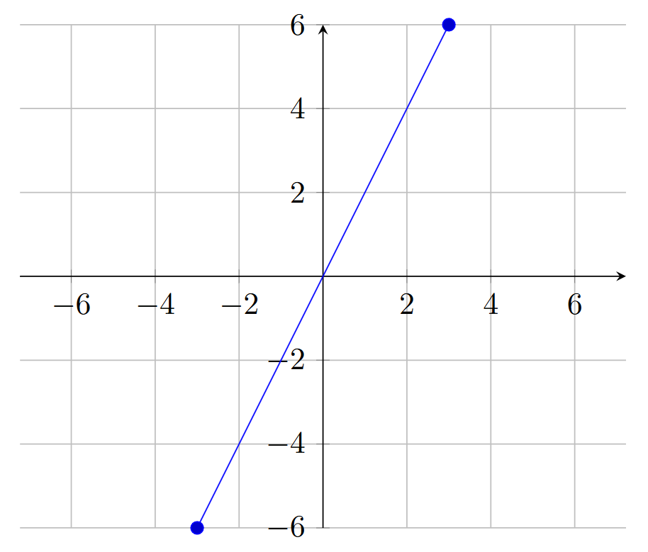

# Visualizing Functions

## Contents

- [Visualizing Functions](#visualizing-functions)
  - [Contents](#contents)
  - [Overview](#overview)
  - [Cartesian Planes](#cartesian-planes)
  - [Parts of a Cartesian Plane](#parts-of-a-cartesian-plane)
    - [Axes](#axes)
    - [Scales](#scales)
  - [How to Graph](#how-to-graph)
  - [Graphing Non-Trivial Functions](#graphing-non-trivial-functions)
  - [The Straight-Line Test](#the-straight-line-test)
  - [Tables](#tables)
  - [Closing](#closing)

## Overview

One helpful trick to working with functions is to visualize them to better understand their behaviors.

With a graph, you can identify particular features of a function, how it changes as the input increases or decreases, and much more.

Alternatively, you can utilize a table, which depicts different calculated values of the output of the function against its inputs, which can help identify patterns, growth, etc.

## Cartesian Planes

Functions are most commonly graphed on Cartesian planes.

Defining Cartesian planes is tricky, since up-to-now, geometry has yet to be discussed (see: dimensions, planes, etc. in [Geometry](../2-Geometry/0-Introduction.md)). A $\textcolor{cyan}{\textnormal{Cartesian plane}}$ can be thought of as a flat surface (it has a length and a width, sometimes infinite) with two perpendicular number lines. Simply put, make a cartesian plane by simply overlapping two number lines so they overlap to make a big plus sign.

## Parts of a Cartesian Plane

### Axes

The number lines are called $\textcolor{cyan}{\textnormal{axes}}$, and they each represent a specific quantity. The input (usually represented by the letter $x$) is represented by the horizontal line, while the output (usually, $y$ or $f(x)$) is represented by the vertical line.

The points at which numbers are annotated on the axes are generally referred to as $\textcolor{cyan}{\textnormal{ticks}}$. Ticks are usually denoted with a small line that stems from the axes itself (the ***tick mark***). Ticks help make charts easier to read.

In the chart above (Figure 1.2.1), the chart instead utilizes grid marks, which make it even easier to study the behavior of the function. Grid marks essentially extend the tick marks to the edges of the cartesian plane for easier viewing.

> Both tick marks and grid marks are completely optional, although they make it far easier to understand the graph and function.

Arrows are often present at the end of the axes lines as well, which denote that the axes extend forever (infinitely). These too are optional (they are implied, typically).

Further still, arrows may be present on the line itself, implying that this behavior extends forever as well. The use of these kinds of arrows depends on the nature of the function being graphed!

### Scales

The number lines can be scaled as desired to show whichever behavior or characteristic is desired. The most common scale for the axes is $\textcolor{cyan}{\textnormal{linear}}$, which means that the distance between tick marks represents a constant value (e.g., increasing by 1: $1, 2, 3, ...$; by 2: $2, 4, 6, ...$; etc.).

Another relatively common scale includes the $\textcolor{cyan}{\textnormal{logarithmic}}$ scale, which is useful for quickly growing (or decaying) functions. A scale that is logarithmic increases by the power of ten (each 'tick' represents $10^0, 10^1, 10^2, ...$).

It is also possible to scale the $x$ and $y$ axes differently. For instance, one may be linearly scaled while the other is logarithmically scaled. Alternatively, you could have both be linear scales, but the $x$ axis increases by 1 every tick mark, while the $y$ axis could increase by 2.

> The scales you choose for a graph depend on the nature of the graph itself and what you are trying to study or understand.

## How to Graph

The graph above has a linear scale. You can see that because each tick is labeled with a number, and those numbers are a constant value apart (in this case, $2$). You can also see that the graph displays a linear function: one that grows at a constant rate. In this case, $y=f(x)=2x$.

> This function, $f(x)=2x$, is a linear function in slope-intercept form, but this will be explored more in [Linear Functions](../4-Linear%20Functions/0-Introduction.md), but let's not get ahead of ourselves.

A graph can be created for any function or relationship by computing input and output pairs. These input and output pairs are called $\textcolor{cyan}{\textnormal{ordered pairs}}$, named because the input comes first, then the output: $(x, y)$. Hence, they are *in order*.

Every place in a cartesian plane may be indexed via a pair of values; one from the x-axis and one from the y-axis. These are coupled together in an ordered pair, like this: $(x_1, y_1)$. This allows referring to any given point in a cartesian plane.

Now, the center point, when $x_1=0$ and $y_1=0$ is referred to as the $\textcolor{cyan}{\textnormal{origin}}$. It is the point at which the axes cross. Where $x$ and $y$ are zero.

To create a graph of a line, you need at least two ordered pairs, since two points create a line. The chart above utilizes two points: $(-3, -6)$ and $(3, 6)$ to create the plot. Now, that line that is graphed actually has an INFINITE number of ordered pairs! That's because you can use any real number as an input, meaning you can have any ordered pair you want, like $(1.25, 2.5)$ or maybe even $(2.2222222, 4.4444444)$.

## Graphing Non-Trivial Functions

Plotting a function gets a bit more tricky with more complicated functions. You need more points to better represent their behavior, which requires more number-crunching and overall makes the entire effort much less fun.

Luckily, that's where graphing calculators come in. They are capable of graphing a particular function (some of them even support multivariate functions; plotting in 3D!) across a particular window of values (that is, what you are able to see in the *window*).

Graphing calculators vary widely in their user-interface and how they accept the functions. A common graphing calculator, the TI-84, utilizes a simple list of functions, and providing a particular function into that entry, and it will be plotted.

> Rather than go through many calculators' interfaces, that is left up to the reader. There are plenty of resources available for this (such as, the user manual with the calculator) and is thus deemed out-of-scope for this book. No point repeating it over-and-over.

## The Straight-Line Test

If you have a graph of a *formula*, you can classify it as a *function* using the straight-line test.

The $\textcolor{cyan}{\textnormal{Straight-Line Test}}$ (aka, the vertical-line test) is a visual test to identify whether each and every input has only one output (and thus, whether the targeted formula is a function). To perform the test, you would draw vertical lines through each input for a function to identify whether it has only one output per input.

You could imagine that it would be quite difficult to do this for *every* input. 3.1? Then $3.11$? And what about $3.1111111111$?

Instead, it can be a visual cue, performed abstractly when you look at a function's graph.

> ### Example: Straight-Line Test
>
> What about a linear formula, like $y = 2x$? Is $y$ a function?
>
> You could graph the formula, and get the following graph:
>
> 
>
> If you look at each input in the graph, you'll notice that there is exactly one output. You can verify this mathematically (that you only get one value for every input), but you can instead verify this with the vertical line test.
>
> Draw a vertical line at each tick mark (feel free to expand the window if desired). Now, look at how many points of the graph the straight-line intersects. If it is only 1 intersection at each of the lines, then you can see that this passes the vertical-line test, making this formula a **function**.

## Tables

Rather than taking the effort of drawing functions every single time, an alternative is to list the ordered pairs in a table. Tables help organize the values and enable quick numerical comparisons. The problem with graphs is that it may be difficult to tell the exact values that "lie on the graph", unless you have the function handy.

If you do not have it handy, or want to know the exact values at a particular point, tables are a great alternative. Imagine instead representing $f(x)=2x$ using the table below:

|   x   |   y   |
| :---: | :---: |
|  -3   |  -6   |
|  -2   |  -4   |
|  -1   |  -2   |
|   0   |   0   |
|   1   |   2   |
|   2   |   4   |
|   3   |   6   |

This makes it very easy to see a handful of inputs and their corresponding outputs. It also more easily allows computing different charactistics about the function, such as its rate of change, horizontal intercept (aka $x$-intercept), and vertical intercept (aka $y$-intercept). These characteristics will be discussed in Chapter 3.

---

---

## Closing

The next few sections will discuss characteristics of functions, that can help in describing functions and their behaviors.

|                Previous                |                                       Next                                       |
| :------------------------------------: | :------------------------------------------------------------------------------: |
| ← [1.1.1: Functions](./1-Functions.md) | [1.1.3: Characteristics of Functions](./3-Characteristics%20of%20Functions.md) → |
