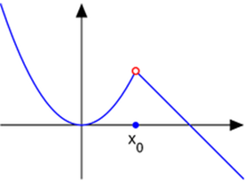
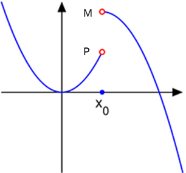
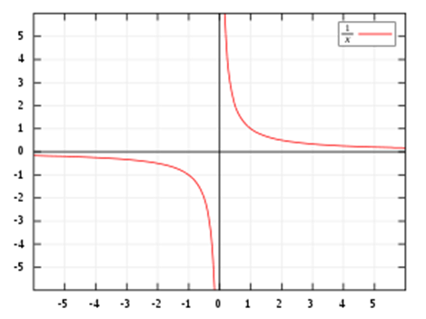
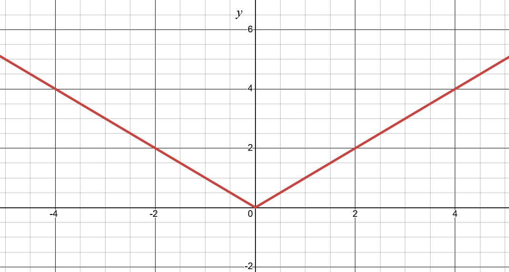

# Classes of Functions

## Contents

- [Classes of Functions](#classes-of-functions)
  - [Contents](#contents)
  - [Overview](#overview)
  - [Function Classes](#function-classes)
  - [Describing a Function's Input or Output](#describing-a-functions-input-or-output)
    - [Intercepts](#intercepts)
    - [Continuity](#continuity)
      - [Removable Discontinuity](#removable-discontinuity)
      - [Jump Discontinuity](#jump-discontinuity)
      - [Infinite Discontinuity](#infinite-discontinuity)
    - [Bounded Functions](#bounded-functions)
  - [Describing a Function's Shape](#describing-a-functions-shape)
    - [Smooth Functions](#smooth-functions)
    - [Symmetry](#symmetry)
  - [Closing](#closing)

## Overview

Because there are so many functions, there is a need to classify functions based on their behaviors or classifications. This section discusses the various types and describes how to differentiate them. It also provides the corresponding functions for each type of function.

## Function Classes

Classifications take on two different forms: those that describe the behavior, and those that describe the characteristics of a function.

***Behavior-based classifications*** describe the overall *behavior* of the function; that is, what are the particular features that describe its overall shape over different inputs?

***Characteristic-based classifications*** describe particular typically-localized aspects of the function, such as the functions maxima or minima, intercepts, continuity, etc.

Behavior-based classifications are discussed across the next few chapters, while characteristic-based classifications are discussed in the next sections.

## Describing a Function's Input or Output

### Intercepts

One such way to describe a function is to identify where the function intersects with the $x$ or $y$ axes.

This is a particularly useful tool when graphing a function, because it gives a clear starting point for plotting.

For a 2D function (that is, only one input, and thus one corresponding output) there are 2 intercepts.

The $\textcolor{cyan}{x-\textit{intercept}}$ is the point at which the function intersects with the $x$ axis. That is, what value of $x$ results in a value of the function of $0$?

You can find the $x$-intercept by solving for $x$ when $f(x) = 0$.

The other intercept is the $\textcolor{cyan}{y-\textit{intercept}}$, which is the point at which the function intersects with the $y$ axis. That is, what value of $y$ results from an input value of $x=0$?

You can find the $y$-intercept by calculating $f(0)$.

Some functions may have more than one $x$-intercept, but no ***function*** should have more than one $y$-intercept (formula and equations might, however!). Ultimately, this depends on the nature of the function itself, and will be described in more detail upon those details.

### Continuity

Functions may be described as *continuous* or *discontinuous*.

Functions lacking abrupt changes in value are considered $\textcolor{cyan}{\textit{continuous}}$.

> [!NOTE]
>
> More specifically, a **continuous function** is one that meets all of the following criteria for all $c$, where $c$ is a possible value of the input variable.
>
> - $f(x)$ is defined at $x = c$
> - $\lim_{x \to c}{f(x)}$ exists.
> - $\lim_{x \to c}{f(x)} = f(c)$
>
> *(You are not expected to know this just yet. Limits will be discussed soon!)*

---

$\textcolor{cyan}{\textit{Discontinuous}}$ functions feature a characteristic known as a $\textcolor{cyan}{\textit{discontinuity}}$, which is any abrupt change in value.

#### Removable Discontinuity

The "simplest" kind of discontinuity is a $\textcolor{cyan}{\textit{Removable Discontinuity}}$, which is one in which the function approaches the same values regardless of the direction $x$ is approaching.

    
     
    Figure 1.3.1: Removable Discontinuity at x0

Notice that if you approach $x_0$ from the left side (that is, $x$ increases from $-\infty$ to $x_0$), then the function approaches the y-value denoted at the red-circle.

Likewise, when approaching $x_0$ from the right side (that is, $x$ decreases from $\infty$ to $x_0$), the function approaches the y-value denoted at the red circle. Despite these conclusions, though, the function's actual value at $x_0$ is denoted by the solid circle.

> This solid versus hollow circle notation is important.
>
> A ***hollow circle*** denotes that the value does NOT exist at this location. It indicates a $\textcolor{cyan}{\textit{hole}}$ in the graph.
>
> A ***solid circle*** denotes an output at a particular point, which should be labelled. In the case of the Figure above, it is labelled at $x_0$

#### Jump Discontinuity

Another type of discontinuity is a $\textcolor{cyan}{\textit{Jump Discontinuity}}$, where the function approaches different values based on the direction $x$ is approaching.

    
     
    Figure 1.3.2: Jump Discontinuity at x0

You'll notice that if you do the same approach of approaching $x_0$ from the left and right, the values they approach do not match. When approaching from the left, you approach $P$. When approaching from the right, you approach $M$. This is the fundamental characteristic of a jump discontinuity.

#### Infinite Discontinuity

The final kind of discontinuity to discuss is an $\textcolor{cyan}{\textit{Infinite Discontinuity}}$. This is a special kind of jump discontinuity such that the limits from either side approach infinity (may be both positive, both negative, or one each):

    
     
    Figure 1.3.3: Infinite Discontinuity at x=0, for function <code><i>f(x)=1/x </i></code>

These kinds of discontinuities are also known as a $\textcolor{cyan}{\textit{Vertical Asymptote}}$.

### Bounded Functions

A $\textcolor{cyan}{\textit{bounded}}$ function is one that is finite.

In other words, all values of the function will lie between some values $k$ and $m$, where both $k$ and $m$ are real numbers. That is, the following will be true:
$$
\begin{aligned}
&f(x) \leq k \\
&f(x) \geq m \\
\end{aligned}
$$

Because both $k$ and $m$ are real numbers, this enforces the concept that no value of $f(x)$ will be infinite!

$\textcolor{cyan}{\textit{Unbounded}}$ functions are those that extend toward infinity. Many functions are *unbounded*. For instance, Linear functions are unbounded.

Some functions are "semi-bounded", meaning they are only bounded on one side of the output. That is, there may be functions that are...

- $\textcolor{cyan}{\textit{Bounded above}}$, which means that only $f(x) \leq k$ holds true. In other words, all function values are less than (or equal to) some real number $k$.
- $\textcolor{cyan}{\textit{Bounded below}}$, which means that only $f(x) \geq m$ holds true. In other words, all function values are greater than (or equal to) some real number $m$.

## Describing a Function's Shape

### Smooth Functions

A $\textcolor{cyan}{\textit{smooth}}$ function describes one such that the function is *differentiable* everywhere. Put more simply, a smooth function is essentially a special type of continuous function where there are no immediate shifts in its rate of change. For instance, a linear graph is smooth, while the following graph is not smooth. It is a graph of the absolute value of $x$ (that is, $f(x) = |x|$)

    
     
    Figure 1.4.7: Graph of an Absolute Value function, which is not smooth.

### Symmetry

A $\textcolor{cyan}{\textit{symmetrical}}$ function describes a function such that the function is the same across an axis.

Typically, symmetry for functions applies across the $y$ axis.

Functions like the Quadratic function is symmetric across the $y$ axis. Some functions, like the Cubic function, are actually symmetric across $f(x)=-x$ (that is, reflected diagonally).

## Closing

| Previous                                 | Next                                                     |
| ---------------------------------------- | -------------------------------------------------------- |
| $\leftarrow$ [Graphing](./3-Graphing.md) | [Linear Functions](./5-LinearFunctions.md) $\rightarrow$ |
